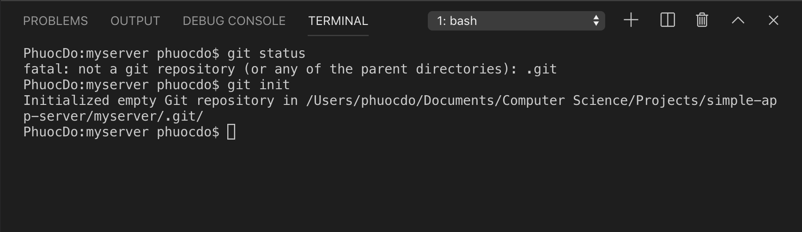

# Article 2: Introduction to Git - Part 1: Commit Changes

Git is an essential tool for version control and collaboration in a code project. If you still have confusions, don't worry. We will dive into every aspect of this tool later.

Because Git has many complexities, we will break down the series **Introduction to Git** into 4 parts:

* Part 1: Commit Changes
* Part 2: Create Branches
* Part 3: Push changes to a Remote Repository
* Part 4: Pull changes from a Remote Repository

## Table of Contents

[1. Introduction to Git](2-intro-to-git-part-1-commit-changes.md#1)  
  [1.1. What is Git?](2-intro-to-git-part-1-commit-changes.md#1.1)  
  [1.2. Install Git for MacOS and Windows](2-intro-to-git-part-1-commit-changes.md#1.2)  
 [2. Why Commit Changes?](2-intro-to-git-part-1-commit-changes.md#2)  
 [3. Visualization of Concept](2-intro-to-git-part-1-commit-changes.md#3)  
  [3.1. `git commit`](2-intro-to-git-part-1-commit-changes.md#3.1)  
  [3.2. `git log`](2-intro-to-git-part-1-commit-changes.md#3.2)  
  [3.3. `git checkout`](2-intro-to-git-part-1-commit-changes.md#3.3)  
 [4. Practice with a Django project](2-intro-to-git-part-1-commit-changes.md#4)  
 [5. What's Next?](2-intro-to-git-part-1-commit-changes.md#5)  
  [5.1. Share Code with Collaborators on GitHub](2-intro-to-git-part-1-commit-changes.md#5)  
  [5.2. How to make Project Setup easy for Collaborators](2-intro-to-git-part-1-commit-changes.md#5)  
  [5.3. Understand Django project settings](2-intro-to-git-part-1-commit-changes.md#5)  
  [5.4. Document a Django project](2-intro-to-git-part-1-commit-changes.md#5)  


## 1. Introduction to Git <a id="1"></a>

#### 1.1. What is Git? <a id="1.1"></a>

Git is a Version Control System for tracking changes happening in a project. So what is a Version Control System? There are a few ways to think about its benefits:

* You have done some changes to your project, but then it goes wrong. Now you want to change it back.
* You would like to share your project code with other people, but you don't want to download and upload to a shared drive because it's time-consuming for everyone.
* You make some changes \(called A\) to the project, and another person makes some other changes \(called B\) to the project. You need a way to merge A and B together.

  Luckily, Git can save us here.

#### 1.2. Install Git for MacOS and Windows <a id="1.2"></a>

#### Git for Mac Installer

The easiest way to install Git on a Mac is via the stand-alone installer:

 **Step 1:** Download the latest Git for [Mac installer](https://sourceforge.net/projects/git-osx-installer/files/).

 **Step 2:** Follow the prompts to install Git.

 **Step 3:** Open a terminal and verify the installation was successful by typing `git --version`:

```bash
> git --version
git version 2.9.2
```

 **Step 4:** Configure your Git username and email using the following commands, replacing Emma's name with your own. These details will be associated with any commits that you create:

```bash
> git config --global user.name "Emma Paris"
> git config --global user.email "eparis@atlassian.com"
```

#### Git for Windows stand-alone installer

 **Step 1:** Download the latest Git for [Windows installer](https://gitforwindows.org/).

 **Step 2:** When you've successfully started the installer, you should see the Git Setup wizard screen. Follow the Next and Finish prompts to complete the installation. The default options are pretty sensible for most users.

 **Step 3:** Open a Command Prompt \(or Git Bash if during installation you elected not to use Git from the Windows Command Prompt\).

 **Step 4:** Run the following commands to configure your Git username and email using the following commands, replacing Emma's name with your own. These details will be associated with any commits that you create:

```bash
> git config --global user.name "Emma Paris"
> git config --global user.email "eparis@atlassian.com"
```

## 2. Why Commit Changes? <a id="2"></a>

In this article, we will learn about the first basic Git concept: **Commit**. Before we dive into the details, we would like you to understand why we need to **commit changes**.

### Situation

Imagine that you are working on a project with a very large codebase. At first, the code runs really well. Then, you develop a new feature, add some new files, and change some old code in the project. But now when you run your project again, it crashes. That's a big OOPS right there, and you just wish that you can go back to the older version of this project when it was still working.

### Resolution

Luckily, Git allows you to save each version of your project into the Git system. If the new version does not work, you can always revert back to the older versions in a snap. Sounds cool ehhh?

However, instead of calling it a `version`, we usually say a **`commit`**.

### Definition

A **commit** is basically a snapshot of your project folder. When you make a new commit, it's like you are taking a picture of your current project folder and saving it in the Git system. As we work on our project, we will have more commits \(or snapshots\) in the future. Of course, you can have a look at your old commits if you want too.

> #### Definition
>
> ### A **commit** is basically a snapshot of your project folder.

To make this guide more intuitive, we will divide it into two sections:

* **Visualization of Concept**: You will learn how this concept works by typing real commands and seeing the outcomes with visualization.
* **Practice with a Django project**: After you understand how it works, we will apply it in a sample Django project.

## 3. Visualization of Concept <a id="3"></a>

First, let's open this link: [http://git-school.github.io/visualizing-git/\#free](http://git-school.github.io/visualizing-git/#free). We will need this to visualize our concept.

Once you open the link, look at the visualization panel. You can see a node labelled with **`master - HEAD`** similar to the image below:


This node represents the current **commit** of your project. It contains all the code files that you have created so far.

### 3.1. `git commit` <a id="3.1"></a>

Then, let's say you just added some code for a new feature `featureA`, and you need to save this new version of your project into the Git system. In the Command Prompt on the website, type this command:

  `git commit -m "Added featureA"`

If you do it properly, you should see a new node created and appended next to your first commit:


This new node represents the new commit that you just made. Now, let's say you deleted some file `file1.js` from the project, and you commit this change into the Git system with this following command:

  `git commit -m "Delete file1.js"`

Then, you should expect the following result:


### 3.2. `git log` <a id="3.2"></a>

So far, you have three commits \(or versions\) of your project as you can see in the image above. However, when you work in a real project, there is no visualization for you to see all the commits that you made. In this case, you can list all the commits with the following command:

  `git log`


### 3.3. `git checkout` <a id="3.3"></a>

Now, for some reason, you want to have a look at the deleted file `file1.js`. You can do this by checking out the previous commit. In my case, the _sha-1 number_ of the previous commit is `f475695`, so the checkout command would be:

  `git checkout f475695`


As you see, `HEAD` is now under the previous commit that you made. What does that mean? It means that, when you look at your project folder right now, all the files in your previous commit, including your deleted file `file1.js`, has been recovered. You will see this when we practice with a real project folder in the [next section](2-intro-to-git-part-1-commit-changes.md#4).

After checking that deleted file, let's say you want to get back to the most recent commit to continue working on the project. There is a fast way to do this. If you look closer to the visualization, you will see the label `master` under the most recent commit. So to checkout this commit, we can just use `master` instead of the _sha-1 number_:

  `git checkout master`


As you see, the `master` label is a bit special. As we add more commits, the `master` label will always point at the last commit that we make. Because of this characteristic, we usually call it a **branch** instead. A **branch** is simply a pointer to a specific commit -- nothing more.

In the image above, there is only one branch `master`, the _default_ branch. In the next article, we will show you how to create a new branch as well as why we need to do so.

## 4. Practice with a Django project <a id="4"></a>

You have now known the basics about `git commit`. In this section, we will start using it in a real Django project as follows:

* [First, initialize git for our project](2-intro-to-git-part-1-commit-changes.md#4.1).
* [Then, create the first commit](2-intro-to-git-part-1-commit-changes.md#4.2).
* [After that, modify the `SECRET_KEY` and commit](2-intro-to-git-part-1-commit-changes.md#4.3).
* [Finally, check out the first commit](2-intro-to-git-part-1-commit-changes.md#4.4).

### 4.1. Initialize Git <a id="4.1"></a>

If you want use Git in your project, you must first initialize git for your project folder.

#### Step 1: Create a Django project <a id="4.1.1"></a>

If you already created a Django project from [Article 1](https://github.com/binanhphuoc/IPS-Docs/tree/eab49bab8eb1fbea5270935cddcd1a160802a1df/Guides/1-set-up-python-dev-env.html), you can move on to [Step 2](2-intro-to-git-part-1-commit-changes.md#4.1.2). Otherwise, you can download a sample Django project folder in the following link:

link

As you extract the zip file, make sure that you see a folder named `myserver` inside.

#### Step 2: Initialize Git for the project <a id="4.1.2"></a>

Open your project folder `myserver` in VS Code, and toggle `Ctrl + ~`/`Cmd + ~` to open the Terminal/Command Prompt. If you type `git status`, you'll see that git currently does not track your project folder.


To initialize Git for your project folder, type in the following command:

  `git init`

If you do it properly, you should expect this following result:



What happens when you initialize git? Git will create a hidden folder named `.git` inside of your project folder. This is where git stores all the commits along with other tracking information of your project.

### 4.2. Create the `first commit` <a id="4.2"></a>

In reality, making a commit is a bit more complicated than in Visualization.

> There are two steps to make a commit:
>
> * Step 1: Specify what changes to commit
> * Step 2: Commit

#### Step 1: Specify what changes to commit

Before you can commit, you must tell Git what changes to commit. These changes can be newly added files, edited files, or removed files. There are a few commands to tell Git what to commit:

> \(1\) Some newly added file or edited file: `git add [path/to/that/file]`  
>  \(2\) All newly added files and edited files in a specific folder: `git add [path/to/that/folder]`  
>  \(3\) Some deleted file: `git rm [path/to/that/file/before/deleted]`  
>  \(4\) All deleted files shown by "git status": `git rm $(git ls-files --deleted)`

Here, all files are new to Git, so Git treats them as newly added files. You want to tell Git that you want to prepare all of them for the next commit. To do so, you can apply command \(2\) because all these newly added files are in the current folder `myserver`:

  `git add .`

`.` stands for the current folder, which is `myserver`. Now, if you type `git status`, you can see all the changes to be committed as follows:


#### Step 2: Commit

Great, now it's time to commit all these new files:

  `git commit -m "first commit"`


To list all the commits so far with each commit written in one line, type:

  `git log --oneline`

As shown, there is only one commit so far:


### 4.3. Change something in the project and Commit <a id="4.3"></a>

In file `myserver/myserver/settings.py`, change the value of `SECRET_KEY` to `'my_secret_key'`. Then, save the file.


Now, if you type `git status`, Git will say that it sees some changes like this:


Let's commit this:

  `git add .`  
   `git commit -m "Modify the SECRET_KEY"`

Listing all commits out, you can now see your second commit in the log as follows:


### 4.4. Checkout the first commit <a id="4.4"></a>

Now, let's go back to the first commit:

  `git checkout 4bd3424`

If you do it correctly, you can see that the `SECRET_KEY` has been reverted.


You can also verify that you are currently at your first commit by `git log` as follows:

  `git log --oneline --all`


As you can see, `HEAD` is now at the first commit.

## 5. What's Next? <a id="5"></a>

See you in Git Introduction - Part 2: Create Branches.

