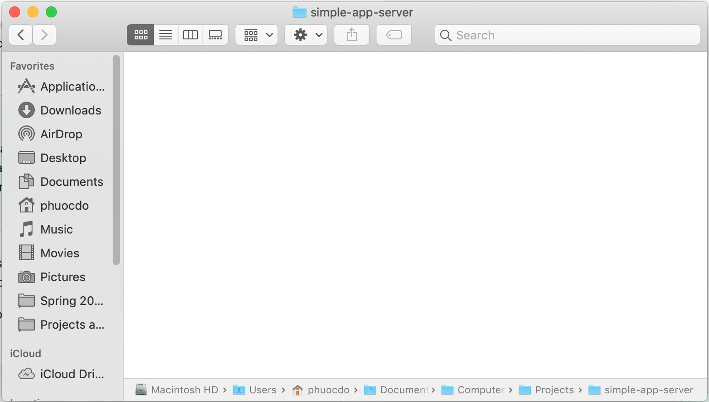

# Article 1: Set Up a Python Development Environment

From Section 1 to Section 3, we will briefly introduce you to a few necessary dev-tools for Python development. You can jump to [Installation in Section 4](1-set-up-python-dev-env.md#4) if you are not in the mood of reading.

## Table of Contents

[1. Development Tools to Use](1-set-up-python-dev-env.md#1)  
  [1.1. Visual Studio Code](1-set-up-python-dev-env.md#1.1)  
  [1.2. Anaconda](1-set-up-python-dev-env.md#1.2)  
 [2. Django and other Python Web Frameworks](1-set-up-python-dev-env.md#2)  
 [3. SymPy - a Symbolic Library in pure Python](1-set-up-python-dev-env.md#3)  
 [4. Installation](1-set-up-python-dev-env.md#4)  
  [4.1. Download Visual Studio Code and Anaconda](1-set-up-python-dev-env.md#4.1)  
  [4.2. Configure Conda Command for Windows User](1-set-up-python-dev-env.md#4.2)  
 [5. Create a Simple Application Server locally](1-set-up-python-dev-env.md#5)  
  [5.1. Create a Conda Environment for our Project](1-set-up-python-dev-env.md#5.1)  
  [5.2. Install Python, JupyterLab, Django, SymPy in the Environment](1-set-up-python-dev-env.md#5.2)  
  [5.3. Create a Django project](1-set-up-python-dev-env.md#5.3)  
 [6. What's Next?](1-set-up-python-dev-env.md#6)  
  [6.1. How to share code with other Collaborators on GitHub](1-set-up-python-dev-env.md#6)  
  [6.2. Create a new feature for Django projects](1-set-up-python-dev-env.md#6)  

## 1. Development Tools to Use 

In this section, we will briefly introduce a few tools to use for Python development. You can start downloading these tools as you read. We will dive the workflow in other sections.

### 1.1. Visual Studio Code 

VS Code is a customizable editor for writing and debugging code. This editor can recognize many popular programming languages and provide the appropriate development tools with a simple interface. Furthermore, VS Code has a built-in terminal which can be toggled with \[Ctrl + ~\]/\[Cmd + ~\].

Download: [https://code.visualstudio.com/](https://code.visualstudio.com/)

### 1.2. Anaconda 

Anaconda is a Python package manager for creating virtual environments, installing Python and non-Python packages in virtual environments, deploying applications, and providing other tools that make coding in Python easier.

Download: [https://www.anaconda.com/distribution/](https://www.anaconda.com/distribution/)

In the image above, we can see Jupyter Lab and Jupyter Notebook already installed inside of Anaconda. These two applications together can launch an interactive environment for live-testing new Python libraries.

## 2. Django and other Python Web Frameworks 

A Python Web Framework provides some basic setup to help developers get started without worrying about the configurations. There are many Python Web Frameworks to choose from. Here are the top 10 Python Web Frameworks in 2019: [https://hackernoon.com/top-10-python-web-frameworks-to-learn-in-2018-b2ebab969d1a](https://hackernoon.com/top-10-python-web-frameworks-to-learn-in-2018-b2ebab969d1a)

The framework that we will use for our application is Django, a fullstack web framework that has been set up with basic libraries and a project structure for web services. Because our goal is to create a secure and scalable Application Server that serves complex computations from authenticated requests, Django is suitable to our use case.

We will cover how to download and use this framework in another section. For now, if you need more information on what Django is, we include some materials below:

* Django Official Website: [https://www.djangoproject.com/](https://www.djangoproject.com/)
* When to Use Django: [https://medium.com/crowdbotics/when-to-use-django-and-when-not-to-9f62f55f693b](https://medium.com/crowdbotics/when-to-use-django-and-when-not-to-9f62f55f693b)
* Compare Django vs Flask: [http://www.mindfiresolutions.com/blog/2018/05/flask-vs-django/](http://www.mindfiresolutions.com/blog/2018/05/flask-vs-django/)

## 3. SymPy - a Symbolic Library in pure Python 

SymPy is a Python library for symbolic mathematics. It aims to become a full-featured computer algebra system \(CAS\) while keeping the code as simple as possible in order to be comprehensible and easily extensible. SymPy is written entirely in Python. For more information: [https://www.sympy.org/en/index.html](https://www.sympy.org/en/index.html)

MapleSoft and Wolfram Language are also symbolic languages, but they are very strict for what we want to achieve: a free and easy project setup that is compatible with other software-dev tools. Therefore, SymPy is a great choice because it is written entirely in Python, a popular programming language that is backed by an extensive pool of users and businesses.

## 4. Installation 

### Step 1: Download Visual Studio Code and Anaconda 

If you have already downloaded and installed these dev-tools from Section 1, you can jump to [Step 2](1-set-up-python-dev-env.md#4.2).

Download VS Code: [https://code.visualstudio.com/](https://code.visualstudio.com/)  
 Download Anaconda: [https://www.anaconda.com/distribution/](https://www.anaconda.com/distribution/)

Install VS Code and Anaconda following the window prompts. Contact me if you have any questions.

### Step 2: Configure `conda` Command for Windows User

If you are using MacOS, you can now start [Creating a Simple Application Server locally](1-set-up-python-dev-env.md#4.3).

For Windows user, in order to use command `conda` in the [Command Prompt](https://www.lifewire.com/command-prompt-2625840), you have to add Anaconda to your path variables following these steps below:

* Hit "Windows Key" and type "variable" in search bar.
* Click "Edit environment variables for your account".
* In the new "Environment Variables" window click on variable "Path" for your \[user account\], then click "Edit...".
* A new window should show up. Click "New" to add these two paths:

  `C:\xxxx\yyyy\Anaconda3`  
   `C:\xxxx\yyyy\Anaconda3\Script`

 If you install Anaconda at `C:\Program Files\Anaconda3`, then your two paths should be:

  `C:\Program Files\Anaconda3`  
   `C:\Program Files\Anaconda3\Script`  

See the following image for reference.

## 5. Create a Simple Application Server locally 

### 5.1. Create a Conda Environment for our Project 

If you wonder what a conda environment is, here is the explanation from the Anaconda documentation.

A conda environment is a directory that contains a specific collection of conda packages that you have installed. For example, you may have one environment with NumPy 1.7 and its dependencies, and another environment with NumPy 1.6 for legacy testing. If you change one environment, your other environments are not affected. You can easily activate or deactivate environments, which is how you switch between them. You can also share your environment with someone by giving them a copy of your `environment.yaml` file. For more information, see [Managing environments](https://docs.conda.io/projects/conda/en/latest/user-guide/tasks/manage-environments.html).

 **Step 1: Open the Terminal/Command Prompt**

 **Step 2: Create a new conda environment**

 Anaconda has a default environment called `base` that is activated automatically whenever we open a Terminal/Command Prompt. To create a new conda environment with the name `simple-app-server`, use the following command:

   `conda create --name simple-app-server`

 You can verify that your new environment is created by listing all the environments as below:

   `conda env list`

 **Step 3: Activate and Deactivate a conda environment**

 By default, Anaconda automatically activates the `base` environment whenever we open a Terminal/Command Prompt. To activate our environment `simple-app-server`, we need to first deactivate the `base` environment:

   `conda deactivate`  

 Then we can activate our `simple-app-server` environment:

   `conda activate simple-app-server`

### 5.2. Install Python, JupyterLab, Django, SymPy in the Environment 

 **Step 1: Open the Terminal/Command Prompt**

 Skip to the next step if you've already opened a Terminal/Command Prompt.

 **Step 2: Activate our `simple-app-server` environment**

 Skip to the next step if you've already activated in [section 5.1](1-set-up-python-dev-env.md#5.1). Otherwise, you can activate the `simple-app-server` environment as follows:

   `conda deactivate && conda activate simple-app-server`  

 **Step 3: Install Python, JupyterLab, Django, SymPy**

   `conda install -c conda-forge python jupyterlab django sympy`

### 5.3. Create a Django project 

 **Step 1: Create a folder to contain our project**

   Create a folder with any name you want. This name does not affect your project settings. In the image below, the folder name is `simple-app-server`.

 **Step 2: In VS Code, open the newly created folder**

   To open the newly created folder in VS Code, on the menu bar:

   `File > Open...`

   If you do it properly, you should see this view below.

 **Step 3: Toggle on the Terminal/Command Prompt**

   On Windows, press `Ctrl + ~`  
    On MacOS, press `Cmd + ~`  

Then, the view should look like this:

 **Step 4: Activate the `simple-app-server` environment**

   Now type `conda deactivate && conda activate simple-app-server` in the Terminal/Command Prompt above.

 **Step 5: Create a Django project named `myserver`**

   In the Terminal/Command Prompt, type in `django-admin startproject myserver` to create a Django project. If you do it properly, you should see this view:

 **Step 6: Run the Server**

   In the Terminal/Command Prompt:

* Move to the `myserver` directory: `cd myserver`
* Run the server: `python manage.py runserver`

* Now open the browser and access this link: [http://127.0.0.1:8000/](http://127.0.0.1:8000/) or [localhost:8000](http://localhost:8000/)

### Feel free to edit something in the code. If you have some experience in Python and would like to write your own server, this project template above is a very great start.

### Otherwise, we will dive into the project settings and start coding in another post. In case you want to learn these project settings yourself, here is the reference link: [https://docs.djangoproject.com/en/2.2/intro/tutorial01/](https://docs.djangoproject.com/en/2.2/intro/tutorial01/)

## 6. What's Next? 

### 6.1. How to share code with other Collaborators on GitHub

You may have some questions like:

* How do other collaborators work with me on my project?
* Do they have to set up everything from the beginning, or is there any shortcut to make it fast?

### 6.2. Create a new feature for Django projects

